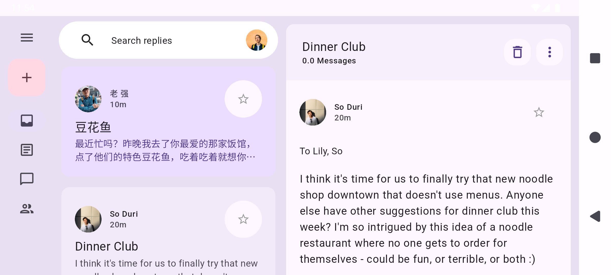
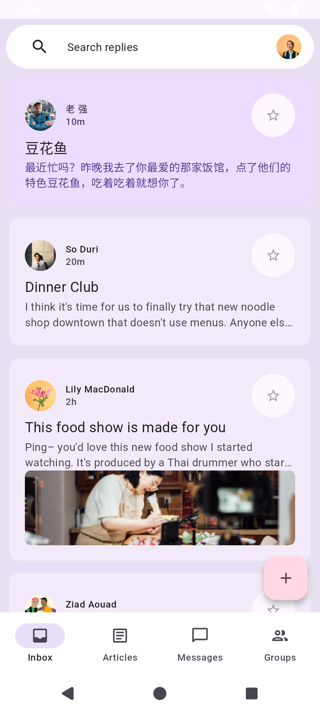

# Animated Responsive Layout with Material 3

A Flutter project demonstrating how to build an animated, responsive app layout using Material 3 design principles. This project is based on the Google Developers course: **"Build an animated responsive app layout with Material 3"**.

## 📱 Project Overview

This application showcases a responsive email-style interface that adapts smoothly between mobile and tablet layouts with elegant animations. The app demonstrates adaptive navigation patterns and seamless transitions between different screen sizes.

## 📸 Screenshots

### Tablet Layout (Horizontal)

*Horizontal layout with navigation rail and expanded content area*

### Mobile Layout (Vertical)

*Vertical layout with bottom navigation bar*

## 🎓 What I Learned

### **Responsive Design**
- Building adaptive layouts that respond to different screen sizes
- Implementing breakpoint-based UI changes (600px, 800px, 1200px, 1600px)
- Using `MediaQuery` to detect screen dimensions and adapt accordingly
- Creating fluid transitions between mobile and tablet layouts

### **Material 3 Design System**
- Implementing Material 3 components and color schemes
- Using modern Material Design navigation patterns
- Working with Material 3's emphasis on color, shape, and motion
- Applying `ColorScheme` for consistent theming

### **Advanced Animations**
- Creating custom animation controllers and curves
- Building complex animation sequences with `TweenSequence`
- Implementing choreographed animations with `AnimationController`
- Using `CurvedAnimation` with custom intervals
- Coordinating multiple animations simultaneously

### **Adaptive Navigation**
- Switching between bottom navigation bar (mobile) and navigation rail (tablet)
- Animating navigation component transitions
- Implementing disappearing/appearing navigation elements
- Managing navigation state across different layouts

### **Custom Transitions**
- Building custom page transitions
- Creating `SlideTransition`, `ScaleTransition`, and `FadeTransition` effects
- Developing list-to-detail view transitions
- Animating floating action button shapes and positions

### **State Management**
- Managing animation states with `SingleTickerProviderStateMixin`
- Coordinating UI state across responsive breakpoints
- Handling lifecycle methods for animation controllers
- Using `setState` effectively for UI updates

### **Widget Composition**
- Breaking down complex UIs into reusable widgets
- Creating custom animated widgets
- Building flexible component hierarchies
- Implementing stateful and stateless widgets appropriately

## ✨ Features

- **Responsive Layout**: Automatically adapts between mobile and tablet views
- **Smooth Animations**: Fluid transitions when resizing or switching layouts
- **Adaptive Navigation**: Bottom bar for mobile, navigation rail for larger screens
- **Animated FAB**: Floating action button that morphs and scales based on layout
- **List-Detail View**: Animated transitions between list and detail views
- **Material 3 Design**: Modern UI following Material Design 3 guidelines
- **Email Interface**: Mock email interface with inbox and reply functionality

## 🛠️ Technologies Used

- **Flutter**: UI framework
- **Material 3**: Design system
- **Dart**: Programming language
- **Custom Animations**: Animation controllers, tweens, and curves

## 📂 Project Structure

```
lib/
├── main.dart                          # Main app entry point
├── animations.dart                    # Custom animation definitions
├── models/
│   ├── models.dart                    # Data models (User, Email, etc.)
│   ├── data.dart                      # Mock data
│   ├── destinations.dart              # Navigation destinations
│   └── widgets/
│       ├── animated_floating_action_button.dart
│       ├── disappearing_bottom_navigation_bar.dart
│       ├── disappearing_navigation_rail.dart
│       ├── email_list_view.dart
│       ├── email_widget.dart
│       ├── reply_list_view.dart
│       ├── search_bar.dart
│       └── star_button.dart
└── transitions/
    ├── bottom_bar_transition.dart
    ├── list_detail_transition.dart
    └── nav_rail_transition.dart
```

## 🚀 Getting Started

### Prerequisites
- Flutter SDK installed
- Dart SDK installed
- An IDE (VS Code, Android Studio, or IntelliJ)

### Installation

1. Clone the repository
```bash
git clone <repository-url>
cd animated_layout
```

2. Install dependencies
```bash
flutter pub get
```

3. Run the app
```bash
flutter run
```

## 🎯 Key Concepts Demonstrated

### Animation Choreography
The app uses carefully timed animation intervals to create smooth, choreographed transitions:
- Navigation rail appears/disappears
- Bottom bar slides in/out
- FAB scales and changes shape
- Content adapts to available space

### Responsive Breakpoints
- **< 600px**: Mobile layout with bottom navigation
- **≥ 600px**: Tablet layout with navigation rail
- **800px - 1600px**: Variable content width scaling

### Custom Animation Curves
- `Curves.easeInOutCubicEmphasized` for smooth motion
- Custom interval-based animations for sequencing
- Reverse curves for seamless back transitions

## 📚 Course Reference

This project is based on the Google Developers course:
[Build an animated responsive app layout with Material 3](https://codelabs.developers.google.com/codelabs/flutter-animated-responsive-layout)

## 📄 License

This project is created for educational purposes as part of the Google Developers Flutter course.

## 🙏 Acknowledgments

- Google Flutter Team for the excellent course materials
- Material Design team for the design guidelines
- Flutter community for ongoing support and resources
